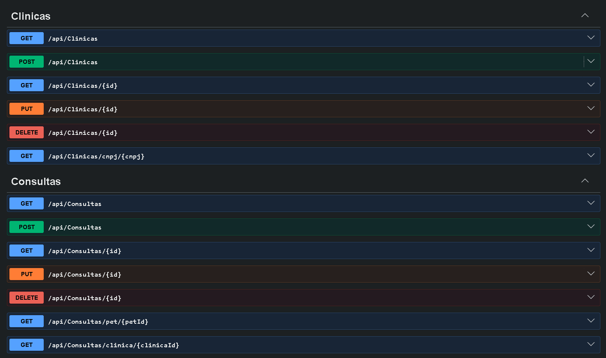
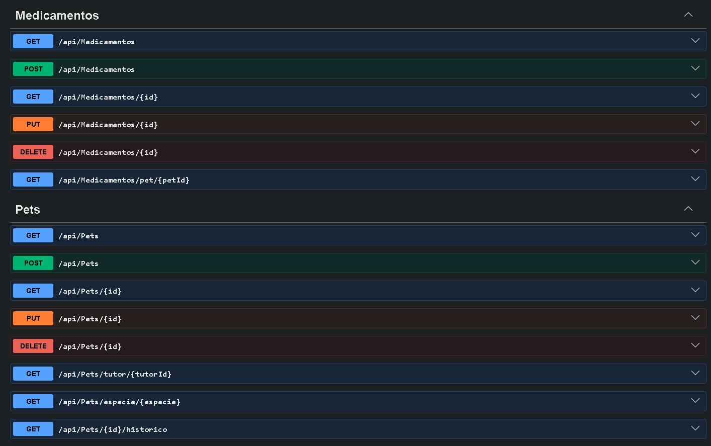
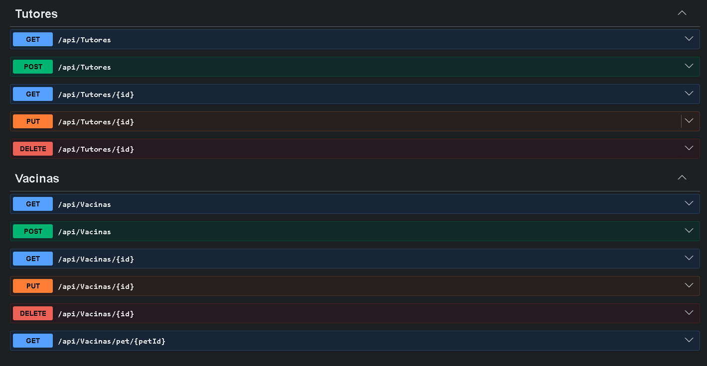

# PetCare 360 — API .NET

API .NET do projeto **PetCare 360**, que estou desenvolvendo no Challenge 2026 da FIAP em parceria com a CLYVO VET.

A ideia é resolver um problema que qualquer dono de pet conhece: hoje a saúde do bicho vive aos pedaços. Tutor vai na clínica só quando o pet adoece, esquece vacina, perde a carteirinha, troca de clínica e o histórico fica perdido. O PetCare 360 tenta juntar tutor, pet, clínica e atendimentos num lugar só — cadastros, consultas, vacinas, medicamentos e o histórico completo de cada animal.

Esta API é o núcleo de cadastro: toda informação principal passa por aqui antes de ir pro app mobile.

## Quem fez

Sou o Murillo RM: 565969, da turma **2TDSPW** (2º ano de ADS na FIAP). Nesse grupo eu fiquei responsável pelas APIs do projeto (.NET e Java). Os outros integrantes:

- **Kauan Vieira de Lima, RM: 565403** cuida do banco Oracle (modelagem, DDL, procedures)
- **João Vitor Lacerda, RM: 565565** faz o app mobile em React Native e o deploy na Azure

- Murillo Fernandes Carapia, RM: 564969
- João Vitor Lacerda, RM: 565565
- Kauan Vieira de Lima, RM: 565403

## O que essa API faz

CRUD completo de 6 entidades:

- `Tutor` — quem é responsável pelo pet
- `Pet` — o animal em si
- `Clinica` — onde os atendimentos acontecem
- `Consulta` — visita veterinária
- `Vacina` — registro de vacinação
- `Medicamento` — prescrição/tratamento

Cada uma tem GET, POST, PUT e DELETE, mais umas rotas extras (tipo "lista todas as vacinas desse pet" ou "me dá o histórico completo desse animal").

## O que mudou nesta sprint

Na sprint anterior a API já fazia o CRUD completo das 6 entidades. Agora ela ficou **observável e testável**:

- **Arquitetura em camadas** — o projeto foi separado em Domain, Application, Infrastructure e API. Antes os controllers falavam direto com o banco; hoje cada camada tem uma responsabilidade só.
- **Health Checks** — três probes (liveness, readiness e startup) pra saber se a aplicação está viva, se o Oracle responde e se as migrations foram aplicadas.
- **Logging estruturado com Serilog** — logs em formato de dados, com correlation id por requisição, saída pra console e arquivo.
- **Tracing e métricas com OpenTelemetry** — cada requisição gera um trace que atravessa as camadas, e as operações de negócio geram métricas de contagem.
- **Testes automatizados** — 35 testes no padrão AAA, sendo 22 unitários com Moq e 13 de integração com WebApplicationFactory.

## Tecnologias

.NET 10 com ASP.NET Core, Entity Framework Core 10, Oracle 19c (banco da FIAP) e Swagger pra documentação. Tudo Code-First — a estrutura das tabelas é definida pelas classes do C# e o EF Core gera o SQL.

Na observabilidade: Serilog pros logs, OpenTelemetry pros traces e métricas, e Microsoft.Extensions.Diagnostics.HealthChecks pros health checks.

Nos testes: xUnit como framework, Moq pros mocks e WebApplicationFactory pra subir a API em memória.

---

# Como instalar e executar

> ⚠️ **Importante:** Esta API usa **Code-First com EF Core Migrations**. Isso significa que **você não precisa criar tabela nenhuma manualmente** — o próprio EF cria toda a estrutura do banco pra você no Passo 4.

## Pré-requisitos

Você precisa ter instalado:

1. **.NET 10 SDK** — baixe em https://dotnet.microsoft.com/download
2. **Acesso a um banco Oracle** — pode ser:
   - Oracle da FIAP (`oracle.fiap.com.br:1521/ORCL`) com seu usuário/senha de aluno
   - Oracle XE local (`localhost:1521/XEPDB1`)
   - Qualquer outra instância Oracle 19c+ que você tenha acesso

Pra conferir se o .NET tá instalado, abre o PowerShell e roda:

```powershell
dotnet --version
```

Tem que aparecer algo tipo `10.0.x`.

---

## Passo 1 — Clonar o repositório

```powershell
git clone https://github.com/MurilloFernandesCarapia/Challenge.NET.git
cd Challenge.NET
```

## Passo 2 — Instalar a ferramenta do EF Core (uma vez só na sua máquina)

Essa ferramenta é o que aplica as migrations no banco. Se você nunca usou EF antes, roda isso:

```powershell
dotnet tool install --global dotnet-ef
```

Se já tem instalado, ele vai dizer "tool already installed", o que é normal. **Feche e reabra o PowerShell** depois desse comando pra atualizar o PATH.

Pra confirmar que funcionou:

```powershell
dotnet ef --version
```

## Passo 3 — Configurar suas credenciais do Oracle

A connection string **não fica no `appsettings.json`**. O arquivo versionado tem só um placeholder, de propósito: senha em repositório público é problema de segurança.

As credenciais vão no **User Secrets**, que guarda os dados fora da pasta do projeto:

```powershell
cd PetCare360.API
dotnet user-secrets set "ConnectionStrings:OracleConnection" "User Id=SEU_USUARIO;Password=SUA_SENHA;Data Source=oracle.fiap.com.br:1521/ORCL;"
cd ..
```

Substitua:
- `SEU_USUARIO` pelo seu usuário Oracle (ex: o seu RM da FIAP)
- `SUA_SENHA` pela sua senha
- `Data Source` se você usa outro servidor (ex: `localhost:1521/XEPDB1` pro Oracle XE local)

No Visual Studio também dá pra fazer pela interface: botão direito no projeto `PetCare360.API` → **Gerenciar Segredos do Usuário** → cola o JSON:

```json
{
  "ConnectionStrings": {
    "OracleConnection": "User Id=SEU_USUARIO;Password=SUA_SENHA;Data Source=oracle.fiap.com.br:1521/ORCL;"
  }
}
```

> 💡 Se o banco que você vai apontar tiver outras tabelas com nomes começando com `TB_` (TB_TUTOR, TB_PET, etc), apague elas antes — o EF vai criar tudo do zero.

## Passo 4 — Criar as tabelas no banco (aplicar as migrations)

Esse é o passo mágico. Roda na raiz do projeto:

```powershell
dotnet ef database update --project PetCare360.Infrastructure --startup-project PetCare360.API
```

> O comando aponta pros dois projetos porque o `AppDbContext` mora no `PetCare360.Infrastructure`, mas quem tem a connection string é o `PetCare360.API`.

O que esse comando faz:

1. Conecta no Oracle usando as credenciais do User Secrets
2. Cria a tabela de controle `__EFMigrationsHistory`
3. Executa as 2 migrations existentes (`InitialCreate` e `AjusteModelo`)
4. Resultado: **6 tabelas criadas** com chaves estrangeiras, índices e constraints prontos:
   - `TB_TUTOR`, `TB_PET`, `TB_CLINICA`, `TB_CONSULTA`, `TB_VACINA`, `TB_MEDICAMENTO`

Se rodar sem erros, tá tudo pronto. Se der erro de conexão, confere as credenciais do Passo 3.

## Passo 5 — Restaurar pacotes e rodar a API

```powershell
dotnet restore
dotnet run --project PetCare360.API
```

O console vai mostrar algo tipo:

```
Now listening on: http://localhost:5260
Now listening on: https://localhost:7031
```

Abre o navegador em uma dessas URLs adicionando `/swagger`:

- **HTTP:** http://localhost:5260/swagger
- **HTTPS:** https://localhost:7031/swagger

Pronto, o Swagger tá aberto e você pode testar todos os endpoints.

---

# Monitoramento e Observabilidade

## Health Checks

A API expõe quatro endpoints de saúde, seguindo a divisão de probes usada em Docker e Kubernetes:

| Endpoint | Tipo | O que responde | Depende do banco? |
|---|---|---|---|
| `/health/live` | Liveness | A aplicação está viva? | Não |
| `/health/ready` | Readiness | A aplicação está pronta pra receber tráfego? | Sim |
| `/health/startup` | Startup | A aplicação terminou de inicializar? | Sim |
| `/health` | Geral | Roda os três de uma vez | Sim |

**Por que separar.** O liveness responde 200 na hora, sem tocar em dependência nenhuma — se ele falhar, o processo travou e precisa ser reiniciado. O readiness verifica o Oracle: se o banco cair, a aplicação continua viva mas não deveria receber requisições, e o orquestrador tira ela do balanceador sem matar o container. O startup checa se as migrations foram aplicadas, porque a API sobe normalmente com o banco vazio e só quebraria na primeira requisição.

**Checks implementados:**

- `self` (tag `live`) — retorna Healthy imediatamente
- `oracle-database` (tag `ready`) — usa `AddDbContextCheck` pra confirmar que o EF consegue conversar com o Oracle
- `migrations` (tag `startup`) — check customizado que verifica se há migrations pendentes

**Exemplo de resposta do `/health/ready`:**

```json
{
  "status": "Healthy",
  "totalDuration": "00:00:00.0424669",
  "entries": {
    "oracle-database": {
      "duration": "00:00:00.0412331",
      "status": "Healthy",
      "tags": ["ready"]
    }
  }
}
```

O `/health/live` devolve só o texto `Healthy`, sem JSON, porque probe de liveness tem que ser o mais leve possível.

**Como usar na prática.** Aponta o healthcheck do Docker ou o liveness probe do Kubernetes pro `/health/live`, e o readiness probe pro `/health/ready`. Um monitor externo pode bater no `/health` de tempos em tempos e alertar quando o status sair de `Healthy`.

## Logs

Os logs são estruturados com **Serilog** e saem em dois lugares:

- **Console** — durante o desenvolvimento
- **Arquivo** — em `logs/petcare360-AAAAMMDD.log`, com um arquivo por dia

Log estruturado significa que a mensagem não é texto solto: os valores viram campos pesquisáveis. Em vez de concatenar string, o código usa template com placeholder nomeado:

```csharp
_logger.LogInformation("Pet cadastrado com sucesso: {@Pet}", pet);
```

O `{@Pet}` serializa o objeto inteiro. Numa ferramenta de log dá pra filtrar por `Pet.Especie` sem precisar fazer regex em cima de texto.

**Correlação de requisições.** Todo request recebe um `CorrelationId`, gerado pelo `CorrelationIdMiddleware`. Ele aparece entre colchetes em toda linha de log daquela requisição e também volta no header `X-Correlation-Id` da resposta. Se o cliente já mandar esse header, a API reaproveita o valor — assim o mesmo id atravessa app mobile, API e qualquer serviço no meio.

Exemplo de saída:

```
[22:32:20 INF] [8c6b7a2b-2485-4b35-b389-ece4eb268889] Tutor cadastrado com sucesso: {"IdTutor": 1, "NmTutor": "Diego Fontes", ...}
[22:32:20 INF] [8c6b7a2b-2485-4b35-b389-ece4eb268889] HTTP POST /api/Tutores responded 201 in 98.9586 ms
```

As duas linhas têm o mesmo id, então dá pra saber que pertencem à mesma chamada mesmo com várias requisições simultâneas.

**Níveis usados:** `Information` pra operações concluídas, `Warning` pra regra de negócio violada (tipo tentar cadastrar pet com tutor inexistente), `Error` pra falhas inesperadas e `Fatal` se a aplicação não conseguir subir.

## Tracing e Métricas

Configurados com **OpenTelemetry**, exportando pro console.

**Tracing** responde "por onde a requisição passou". Cada chamada HTTP gera um trace com um `TraceId`, e dentro dele cada etapa vira um span com `SpanId` e `ParentSpanId`. As operações de negócio criam spans próprios via `ActivitySource`:

| Span | Onde acontece |
|---|---|
| `CadastrarPet` | PetService.CreateAsync |
| `ConsultarHistoricoPet` | PetService.GetHistoricoAsync |
| `CadastrarTutor` | TutorService.CreateAsync |
| `CadastrarClinica` | ClinicaService.CreateAsync |
| `RegistrarConsulta` | ConsultaService.CreateAsync |
| `RegistrarVacina` | VacinaService.CreateAsync |
| `PrescreverMedicamento` | MedicamentoService.CreateAsync |

Cada span carrega tags com o contexto do negócio (`pet.nome`, `pet.especie`, `consulta.clinica`). Assim, num POST de pet, dá pra ver quanto tempo foi HTTP, quanto foi regra de negócio e quanto foi banco.

**Métricas** respondem "como o sistema está no agregado". Vêm de duas fontes.

Automáticas, do ASP.NET Core:
- `http.server.request.duration` — histograma de tempo de resposta, quebrado por rota e status code. É daqui que sai o **tempo de resposta** e, olhando os status 4xx e 5xx, a **taxa de erros**.
- `http.server.active_requests` — requisições em andamento
- `aspnetcore.routing.match_attempts` — contagem por rota

Customizadas, do domínio:
- `pets_created_total` — com a espécie como tag, dá pra saber quantos cães e quantos gatos
- `tutores_created_total`
- `clinicas_created_total`
- `consultas_created_total`
- `vacinas_created_total`
- `medicamentos_created_total`

Os três tipos de métrica aparecem: **Counter** nos contadores de negócio, **Histogram** na duração das requisições e **Gauge** (`LongSumNonMonotonic`) nas requisições ativas.

Pra ver tudo funcionando, sobe a API e faz qualquer chamada — o console mostra o trace completo e, a cada intervalo, o dump das métricas.

---

# Testes

São **35 testes automatizados**, todos no padrão **AAA** (Arrange, Act, Assert), separados em dois projetos por camada.

## Como rodar

Todos:

```powershell
dotnet test
```

Só os unitários:

```powershell
dotnet test PetCare360.UnitTests
```

Só os de integração:

```powershell
dotnet test PetCare360.IntegrationTests
```

Com mais detalhe na saída:

```powershell
dotnet test --logger "console;verbosity=detailed"
```

No Visual Studio: menu **Teste** → **Gerenciador de Testes**.

## Testes Unitários (22 testes)

Ficam em `PetCare360.UnitTests` e exercitam as camadas de **Domínio e Aplicação**. Nenhum encosta no banco: as dependências são substituídas por mocks do **Moq**.

```
PetCare360.UnitTests/
├── Fixtures/
│   └── TelemetryFixture.cs        ← IMeterFactory compartilhado via ICollectionFixture
├── Services/
│   ├── PetServiceTests.cs         ← 9 testes
│   ├── ConsultaServiceTests.cs    ← 4 testes
│   └── TutorServiceTests.cs       ← 3 testes
└── Controllers/
    └── PetsControllerTests.cs     ← 6 testes
```

**Nomenclatura:** todos seguem `MetodoTestado_Cenario_ResultadoEsperado`. Exemplos:

- `CreateAsync_TutorExiste_CadastraPet`
- `CreateAsync_TutorNaoExiste_LancaRegraDeNegocioException`
- `UpdateAsync_PetNaoExiste_RetornaFalse`
- `GetById_PetExiste_RetornaOk`

**Fixture:** os services recebem um `IMeterFactory` no construtor pra registrar métricas. Criar um provider novo a cada teste seria desperdício, então a `TelemetryFixture` cria um só e o xUnit compartilha entre as classes através da `[CollectionDefinition("ServicesCollection")]`.

**Verificação de chamadas:** além dos asserts no retorno, os testes usam `Verify` pra checar se o service chamou (ou deixou de chamar) o repositório. É o que prova, por exemplo, que quando o tutor não existe o pet realmente **não** foi gravado:

```csharp
_mockPetRepository.Verify(r => r.AddAsync(It.IsAny<Pet>()), Times.Never);
```

## Testes de Integração (13 testes)

Ficam em `PetCare360.IntegrationTests` e sobem a **API inteira em memória** com `WebApplicationFactory`, disparando requisições HTTP reais.

```
PetCare360.IntegrationTests/
├── FactoryFixture/
│   └── ApiFactoryFixture.cs                    ← sobe a API e troca o banco
└── Integration/
    ├── TutoresControllerIntegrationTests.cs    ← 5 testes
    ├── PetsControllerIntegrationTests.cs       ← 6 testes
    └── HealthCheckIntegrationTests.cs          ← 2 testes
```

**Substituição de dependências:** a `ApiFactoryFixture` remove o registro do Oracle do container de injeção de dependência e coloca um banco **InMemory** no lugar. Assim os testes rodam em qualquer máquina, sem depender do banco da FIAP estar no ar.

**O que é validado:** fluxo HTTP completo, respostas de sucesso (200, 201, 204), tratamento de erros (400, 404), regras de negócio de ponta a ponta, e os endpoints de health check.

O teste `CicloCompleto_CriarAtualizarEDeletar_FunicionaDePontaAPonta` faz o caminho inteiro numa tacada: cria um pet, atualiza, consulta pra confirmar a alteração, deleta e confirma que sumiu.

> **Observação:** o `/health/startup` não é coberto pelos testes de integração porque ele verifica migrations pendentes, e o provedor InMemory não trabalha com migrations. Esse endpoint se valida rodando contra o Oracle de verdade.

---

# Como testar no Swagger (roteiro pra demonstrar tudo funcionando)

Segue essa ordem pra ver a API funcionando ponta-a-ponta. Os IDs retornados nos POSTs (1, 2, 3...) você usa nos passos seguintes.

### 1. Criar um tutor — `POST /api/Tutores`

```json
{
  "nmTutor": "Murillo Silva",
  "cpf": "123.456.789-00",
  "email": "murillo@email.com",
  "telefone": "(11) 99999-1111",
  "endereco": "Rua dos Pets, 360"
}
```

### 2. Criar uma clínica — `POST /api/Clinicas`

```json
{
  "nmClinica": "Clínica Pet Center",
  "cnpj": "12.345.678/0001-99",
  "endereco": "Av. Paulista, 1500",
  "telefone": "(11) 3000-0001",
  "email": "contato@petcenter.com"
}
```

### 3. Criar um pet (usando o `idTutor` do passo 1) — `POST /api/Pets`

```json
{
  "nmPet": "Rex",
  "especie": "Cachorro",
  "raca": "Labrador",
  "dtNascimento": "2020-05-10T00:00:00",
  "peso": 28.5,
  "idTutor": 1
}
```

### 4. Criar uma consulta — `POST /api/Consultas`

```json
{
  "dtConsulta": "2026-05-20T14:00:00",
  "descricao": "Consulta de rotina",
  "diagnostico": "Pet saudável",
  "idPet": 1,
  "idClinica": 1
}
```

### 5. Cadastrar uma vacina — `POST /api/Vacinas`

```json
{
  "nmVacina": "V10",
  "fabricante": "Zoetis",
  "dtAplicacao": "2026-05-20T00:00:00",
  "dtProximaDose": "2027-05-20T00:00:00",
  "idPet": 1,
  "idConsulta": 1
}
```

### 6. Cadastrar um medicamento — `POST /api/Medicamentos`

```json
{
  "nmMedicamento": "Vermífugo",
  "dosagem": "1 comprimido",
  "frequencia": "A cada 6 meses",
  "dtInicio": "2026-05-20T00:00:00",
  "dtFim": "2026-05-20T00:00:00",
  "idPet": 1,
  "idConsulta": 1
}
```

### 7. Ver o histórico completo do pet — `GET /api/Pets/1/historico`

Esse endpoint traz o pet com **todas as consultas, vacinas e medicamentos** juntos. É o coração da API.

### 8. Testar erros propositais (mostra que as validações funcionam)

- `GET /api/Tutores/999` → retorna **404 NotFound** ("Tutor não encontrado")
- `POST /api/Pets` com `idTutor: 999` (tutor inexistente) → retorna **400 BadRequest** com a mensagem "O tutor informado não existe."
- `DELETE /api/Tutores/1` (tutor com pets vinculados) → retorna **erro** porque a regra de FK proíbe deletar tutores que têm pets cadastrados

### 9. Conferir a observabilidade

Depois de fazer essas chamadas, olha o console da aplicação: vão estar lá os logs do Serilog com o correlation id, os spans do OpenTelemetry (`CadastrarPet`, `RegistrarVacina`) e o dump das métricas com os contadores. E acessa `/health` pra ver os três checks respondendo.

---

# Prints do Swagger

Pra ter uma ideia do que esperar antes de rodar, segue como a interface fica:







---

# Endpoints disponíveis

A documentação interativa completa está no Swagger depois de rodar a aplicação. Resumo das rotas:

### Tutores — `/api/Tutores`
- `GET /api/Tutores` — lista todos
- `GET /api/Tutores/{id}` — busca por ID
- `POST /api/Tutores` — cria
- `PUT /api/Tutores/{id}` — atualiza
- `DELETE /api/Tutores/{id}` — remove

### Pets — `/api/Pets`
- `GET /api/Pets` — lista todos
- `GET /api/Pets/{id}` — busca por ID
- `GET /api/Pets/tutor/{tutorId}` — lista pets de um tutor
- `GET /api/Pets/especie/{especie}` — filtra por espécie
- `GET /api/Pets/{id}/historico` — pet + consultas + vacinas + medicamentos ⭐
- `POST /api/Pets` — cria
- `PUT /api/Pets/{id}` — atualiza
- `DELETE /api/Pets/{id}` — remove

### Clínicas — `/api/Clinicas`
- `GET /api/Clinicas` — lista todas
- `GET /api/Clinicas/{id}` — busca por ID
- `GET /api/Clinicas/cnpj/{cnpj}` — busca por CNPJ
- `POST /api/Clinicas` — cria
- `PUT /api/Clinicas/{id}` — atualiza
- `DELETE /api/Clinicas/{id}` — remove

### Consultas — `/api/Consultas`
- `GET /api/Consultas` — lista todas
- `GET /api/Consultas/{id}` — busca por ID
- `GET /api/Consultas/pet/{petId}` — consultas de um pet
- `GET /api/Consultas/clinica/{clinicaId}` — consultas de uma clínica
- `POST /api/Consultas` — cria
- `PUT /api/Consultas/{id}` — atualiza
- `DELETE /api/Consultas/{id}` — remove

### Vacinas — `/api/Vacinas`
- `GET /api/Vacinas` — lista todas
- `GET /api/Vacinas/{id}` — busca por ID
- `GET /api/Vacinas/pet/{petId}` — vacinas de um pet
- `POST /api/Vacinas` — cria
- `PUT /api/Vacinas/{id}` — atualiza
- `DELETE /api/Vacinas/{id}` — remove

### Medicamentos — `/api/Medicamentos`
- `GET /api/Medicamentos` — lista todos
- `GET /api/Medicamentos/{id}` — busca por ID
- `GET /api/Medicamentos/pet/{petId}` — medicamentos de um pet
- `POST /api/Medicamentos` — cria
- `PUT /api/Medicamentos/{id}` — atualiza
- `DELETE /api/Medicamentos/{id}` — remove

### Health Checks
- `GET /health/live` — liveness
- `GET /health/ready` — readiness
- `GET /health/startup` — startup
- `GET /health` — todos de uma vez

**Total: 33 endpoints** (14 GETs + 6 POSTs + 6 PUTs + 6 DELETEs + 1 histórico), **mais 4 endpoints de monitoramento**.

---

# Como os dados se ligam

```
TB_TUTOR (1) ─────┐
                  │ N
                  ▼
TB_PET (1) ──┬──→ TB_CONSULTA (N) ←── TB_CLINICA (1)
             │
             ├──→ TB_VACINA (N)
             │
             └──→ TB_MEDICAMENTO (N)
```

Regras de integridade que ficaram explícitas no banco:

- Não dá pra apagar um tutor que ainda tem pets cadastrados (apaga os pets primeiro)
- Não dá pra apagar uma clínica que tem histórico de consultas (preserva histórico)
- CPF e email do tutor são únicos no sistema
- CNPJ da clínica é único

E as regras que ficam na camada de aplicação:

- Pet só pode ser cadastrado com um tutor que existe
- Consulta exige pet e clínica existentes
- Vacina e medicamento exigem um pet existente

---

# Estrutura do código

O projeto está dividido em 4 camadas, mais 2 projetos de teste. O sentido das dependências é sempre de fora pra dentro: o Domain não conhece o banco nem a API — quem conhece o Domain são as camadas de fora. Isso é o princípio da Inversão de Dependência (o **D** do SOLID) e é o que permite testar as regras de negócio sem banco nenhum.

```
Challenge.NET/
├── PetCare360.Domain/                  ← entidades e contratos. Não depende de ninguém.
│   ├── Entities/                       ← Tutor, Pet, Clinica, Consulta, Vacina, Medicamento
│   ├── Interfaces/                     ← contratos de repositório e de serviço
│   └── Exceptions/
│       └── RegraDeNegocioException.cs
├── PetCare360.Application/             ← regras de negócio. Depende só do Domain.
│   ├── Services/                       ← os 6 services com as regras
│   └── Diagnostics/
│       └── TelemetryConstants.cs
├── PetCare360.Infrastructure/          ← EF Core, Oracle, health checks, OpenTelemetry
│   ├── Data/
│   │   └── AppDbContext.cs             ← configuração do EF Core (Fluent API + relacionamentos)
│   ├── Repositories/                   ← implementações que falam com o Oracle
│   ├── HealthChecks/
│   │   └── MigrationsHealthCheck.cs
│   ├── Migrations/                     ← histórico de mudanças no banco
│   │   ├── 20260512232200_InitialCreate.cs
│   │   └── 20260520025529_AjusteModelo.cs
│   └── DependencyInjection.cs          ← registra tudo no container
├── PetCare360.API/                     ← controllers e configuração da aplicação
│   ├── Controllers/                    ← 6 controllers (Tutores, Pets, Clinicas, Consultas, Vacinas, Medicamentos)
│   ├── Middleware/
│   │   └── CorrelationIdMiddleware.cs
│   ├── Properties/
│   │   └── launchSettings.json         ← perfis de execução (http/https)
│   ├── Program.cs                      ← entrada, Serilog, health checks, Swagger
│   ├── appsettings.json                ← config (a senha fica no User Secrets)
│   └── PetCare360.API.csproj           ← dependências do projeto
├── PetCare360.UnitTests/               ← testes unitários com Moq
├── PetCare360.IntegrationTests/        ← testes de integração com WebApplicationFactory
├── docs/
│   └── screenshots/                    ← prints do Swagger pra documentação
├── .gitignore
├── PetCare360.API.slnx                 ← solução .NET
└── README.md                           ← este arquivo
```

O fluxo de uma requisição:

```
HTTP → Controller → Service (regra de negócio) → Repository → EF Core → Oracle
```

---

# Resolução de problemas comuns

**"dotnet-ef" não é reconhecido como comando**
> Você não instalou o tool. Volte ao Passo 2.

**Erro `ORA-12541: TNS:no listener` ou `ORA-12170: TNS:Connect timeout`**
> A connection string tá errada ou o servidor Oracle não tá acessível. Confere o `Data Source` no User Secrets.

**Erro `ORA-01017: invalid username/password`**
> Usuário ou senha errados no User Secrets, ou você esqueceu de configurar. Confere o Passo 3.

**Erro `ORA-00942: a tabela ou view não existe`**
> Você conectou no banco mas as tabelas não existem nesse schema. Roda o Passo 4.

**Erro `ORA-00955: name is already used by an existing object`**
> O banco já tem alguma tabela com nome conflitante (`TB_PET`, `TB_TUTOR`, etc). Apaga elas no banco antes de rodar as migrations.

**Erro `MSB3027` ou "the process cannot access the file" no build**
> A API ainda está rodando e travou os arquivos. Para ela (Shift+F5 no Visual Studio) antes de compilar.

**Swagger abre mas dá 500 ao testar endpoints**
> Você esqueceu de rodar `dotnet ef database update` no Passo 4. Sem isso as tabelas não existem.

**A página `/swagger` dá 404**
> O perfil de execução tá em produção. Garanta que `ASPNETCORE_ENVIRONMENT` esteja como `Development` (o `launchSettings.json` do projeto já faz isso por padrão).

**`/health/ready` retorna Unhealthy**
> O Oracle não está respondendo. O JSON da resposta traz o detalhe do erro.

---

# Sobre o projeto

Esse é um trabalho de faculdade do meu 2º ano de ADS. Não é production-ready — não tem autenticação, rate limiting, cache distribuído, nada disso. O foco era demonstrar domínio dos conceitos da matéria de **Advanced Business Development with .NET** (Web API, EF Core, Oracle, REST, OpenAPI, e agora observabilidade e testes automatizados).

Uma coisa que os testes de integração revelaram e que ficou anotada pra próxima sprint: como o projeto usa nullable reference types, campos `string` sem `?` viram obrigatórios na validação do ASP.NET mesmo sem `[Required]`. Isso afeta `Raca` no Pet e alguns outros campos que eu tinha pensado como opcionais. Corrigir agora exigiria migration nova, então deixei documentado.

Se você é o professor avaliando isso: bem-vindo, espero ter feito direito 

---

Petcare360 · 2TDSPW · FIAP · Setembro de 2026