# PetCare 360 — API .NET

API .NET do projeto **PetCare 360**, que estou desenvolvendo no Challenge 2026 da FIAP em parceria com a CLYVO VET.

A ideia é resolver um problema que qualquer dono de pet conhece: hoje a saúde do bicho vive aos pedaços. Tutor vai na clínica só quando o pet adoece, esquece vacina, perde a carteirinha, troca de clínica e o histórico fica perdido. O PetCare 360 tenta juntar tutor, pet, clínica e atendimentos num lugar só — cadastros, consultas, vacinas, medicamentos e o histórico completo de cada animal.

Esta API é o núcleo de cadastro: toda informação principal passa por aqui antes de ir pro app mobile.

## Quem fez

Sou o Murillo, da turma **2TDSPW** (2º ano de ADS na FIAP). Nesse grupo eu fiquei responsável pelas APIs do projeto. Os integrantes:

- Murillo Fernandes Carapia, RM: 564969
- João Vitor Lacerda, RM: 565565
- Kauan Vieira de Lima, RM: 565403
- Pedro de Matos Previtali, RM: 564184

## O que essa API faz

CRUD completo de 6 entidades:

- `Tutor` — quem é responsável pelo pet
- `Pet` — o animal em si
- `Clinica` — onde os atendimentos acontecem
- `Consulta` — visita veterinária
- `Vacina` — registro de vacinação
- `Medicamento` — prescrição/tratamento

Cada uma tem GET, POST, PUT e DELETE, mais umas rotas extras (tipo "lista todas as vacinas desse pet" ou "me dá o histórico completo desse animal").

Além disso, a API tem **login com JWT** (perfis Admin e Usuario) e uma **auditoria** gravada no MongoDB, que registra toda criação, atualização e exclusão feita no sistema.

## O que mudou nesta sprint (Sprint 4)

Na Sprint 3 a API ficou observável e testável: arquitetura em camadas, health checks, logs com Serilog, tracing com OpenTelemetry e os primeiros testes. Nesta sprint ela virou uma **API REST completa e segura**:

- **Tratamento global de exceções** — nenhum controller tem `try/catch`. Um `GlobalExceptionHandler` traduz cada erro pro status HTTP certo e responde sempre no padrão **ProblemDetails**, com `traceId` e `correlationId`.
- **Paginação, ordenação e filtros** — todas as listagens aceitam `pagina`, `tamanhoPagina`, `ordenarPor` e filtros próprios de cada entidade, tudo executado direto no banco.
- **HATEOAS** — cada recurso volta com links pras ações possíveis (atualizar, excluir, ver histórico, ver tutor...) e as listas trazem links de navegação entre páginas.
- **MongoDB** — segundo banco do projeto, usado pra **auditoria**. Cada operação gera um documento com entidade, ação, descrição e data.
- **Autenticação e autorização com JWT** — endpoints protegidos, perfis **Admin** e **Usuario**, senhas guardadas com hash PBKDF2.
- **Health check do MongoDB** — o readiness agora confere o Oracle e o MongoDB.
- **Testes** — de 35 pra **122 testes**, com **92,1% de cobertura** nas camadas de Domínio e Aplicação.

## Tecnologias

.NET 10 com ASP.NET Core, Entity Framework Core 10, Oracle 19c (banco da FIAP) e Swagger pra documentação. Tudo Code-First — a estrutura das tabelas é definida pelas classes do C# e o EF Core gera o SQL.

No NoSQL: MongoDB 7 com o MongoDB.Driver, rodando em Docker junto com o Mongo Express (interface web pra ver os dados).

Na segurança: JWT Bearer pra autenticação e PBKDF2 (SHA-256, 100.000 iterações) pro hash das senhas.

Na observabilidade: Serilog pros logs, OpenTelemetry pros traces e métricas, e Microsoft.Extensions.Diagnostics.HealthChecks pros health checks.

Nos testes: xUnit como framework, Moq pros mocks, WebApplicationFactory pra subir a API em memória, e Coverlet + ReportGenerator pro relatório de cobertura.

---

# Arquitetura

O projeto segue a **Clean Architecture**. O sentido das dependências é sempre de fora pra dentro: o Domain não conhece o banco nem a API — quem conhece o Domain são as camadas de fora. Isso é o princípio da Inversão de Dependência (o **D** do SOLID) e é o que permite testar as regras de negócio sem banco nenhum.

## Diagrama da solução

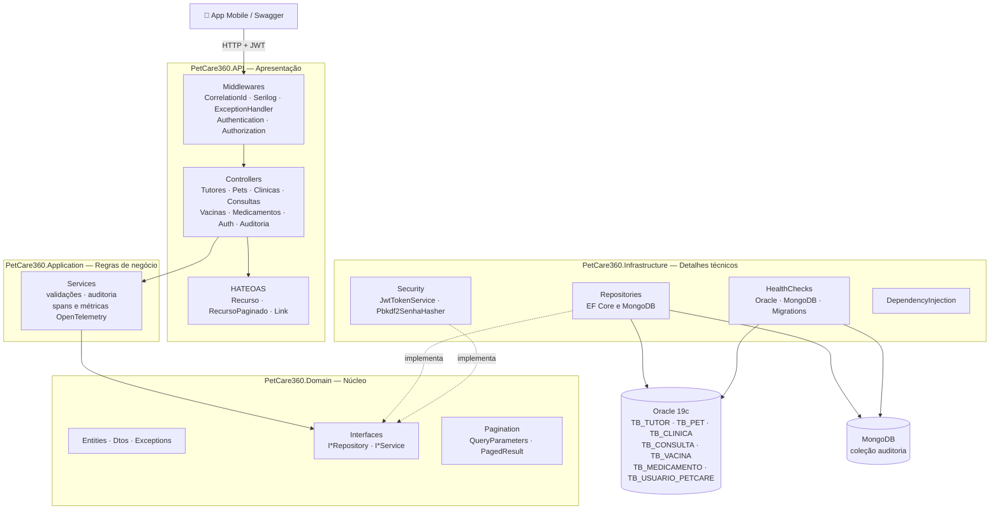
```mermaid
flowchart TB
    Cliente["📱 App Mobile / Swagger"]

    subgraph API["PetCare360.API — Apresentação"]
        MW["Middlewares<br/>CorrelationId · Serilog · ExceptionHandler<br/>Authentication · Authorization"]
        CTRL["Controllers<br/>Tutores · Pets · Clinicas · Consultas<br/>Vacinas · Medicamentos · Auth · Auditoria"]
        HATE["HATEOAS<br/>Recurso · RecursoPaginado · Link"]
    end

    subgraph APP["PetCare360.Application — Regras de negócio"]
        SRV["Services<br/>validações · auditoria<br/>spans e métricas OpenTelemetry"]
    end

    subgraph DOM["PetCare360.Domain — Núcleo"]
        ENT["Entities · Dtos · Exceptions"]
        INT["Interfaces<br/>I*Repository · I*Service"]
        PAG["Pagination<br/>QueryParameters · PagedResult"]
    end

    subgraph INF["PetCare360.Infrastructure — Detalhes técnicos"]
        REPO["Repositories<br/>EF Core e MongoDB"]
        SEC["Security<br/>JwtTokenService · Pbkdf2SenhaHasher"]
        HC["HealthChecks<br/>Oracle · MongoDB · Migrations"]
        DI["DependencyInjection"]
    end

    ORA[("Oracle 19c<br/>TB_TUTOR · TB_PET · TB_CLINICA<br/>TB_CONSULTA · TB_VACINA<br/>TB_MEDICAMENTO · TB_USUARIO_PETCARE")]
    MONGO[("MongoDB<br/>coleção auditoria")]

    Cliente -->|"HTTP + JWT"| MW --> CTRL
    CTRL --> HATE
    CTRL --> SRV
    SRV --> INT
    REPO -.->|implementa| INT
    SEC -.->|implementa| INT
    REPO --> ORA
    REPO --> MONGO
    HC --> ORA
    HC --> MONGO
```

O fluxo de uma requisição:

```
HTTP → CorrelationId → Serilog → ExceptionHandler → Authentication → Authorization
     → Controller → Service (regra de negócio + auditoria) → Repository → EF Core → Oracle
                                                                       └→ MongoDB (auditoria)
```

## Cada camada

| Projeto | O que tem | Depende de |
|---|---|---|
| `PetCare360.Domain` | Entidades, DTOs, exceções de negócio, interfaces e objetos de paginação | ninguém |
| `PetCare360.Application` | Services com as regras de negócio, auditoria e telemetria | Domain |
| `PetCare360.Infrastructure` | EF Core, Oracle, MongoDB, repositórios, JWT, hash de senha, health checks e injeção de dependência | Domain e Application |
| `PetCare360.API` | Controllers, HATEOAS, middlewares, tratamento de erros, Swagger e autenticação | Application e Infrastructure |

## SOLID na prática

- **S — Responsabilidade única:** controller só cuida de HTTP, service só da regra de negócio, repository só do acesso a dados. O `HateoasBuilder` só monta links e o `GlobalExceptionHandler` só traduz exceções.
- **O — Aberto/fechado:** um tipo novo de erro entra como mais um caso no handler global, sem mexer em controller nenhum. Um health check novo é só mais uma classe que implementa `IHealthCheck`.
- **L — Substituição de Liskov:** o `AuditoriaRepository` (MongoDB de verdade) e o `FakeAuditoriaRepository` (dos testes) são trocados livremente porque cumprem o mesmo contrato.
- **I — Segregação de interfaces:** cada entidade tem sua própria interface de repositório e de service. `ISenhaHasher` e `ITokenService` são contratos pequenos e separados.
- **D — Inversão de dependência:** os services dependem só de interfaces do Domain, nunca de EF Core ou MongoDB.

## Injeção de dependência

Tudo é registrado no `PetCare360.Infrastructure/DependencyInjection.cs`, e o `Program.cs` chama só um `builder.Services.AddInfrastructure(builder.Configuration)`:

- repositórios e services como **Scoped** (um por requisição)
- `MongoClient` e o hasher de senha como **Singleton** (são thread-safe e caros de criar)
- configurações (`MongoDbSettings`, `JwtSettings`) pelo Options Pattern

---

# Como instalar e executar

> ⚠️ **Importante:** Esta API usa **Code-First com EF Core Migrations**. Isso significa que **você não precisa criar tabela nenhuma manualmente** — o próprio EF cria toda a estrutura do banco pra você no Passo 5.

## Pré-requisitos

Você precisa ter instalado:

1. **.NET 10 SDK** — baixe em https://dotnet.microsoft.com/download
2. **Docker Desktop** — pra rodar o MongoDB. Baixe em https://www.docker.com/products/docker-desktop
3. **Acesso a um banco Oracle** — pode ser:
   - Oracle da FIAP (`oracle.fiap.com.br:1521/ORCL`) com seu usuário/senha de aluno
   - Oracle XE local (`localhost:1521/XEPDB1`)
   - Qualquer outra instância Oracle 19c+ que você tenha acesso

Pra conferir se tá tudo instalado, abre o PowerShell e roda:

```powershell
dotnet --version
docker --version
```

O primeiro tem que mostrar algo tipo `10.0.x`.

---

## Passo 1 — Clonar o repositório

```powershell
git clone https://github.com/MurilloFernandesCarapia/Challenge.NET.git
cd Challenge.NET
```

## Passo 2 — Subir o MongoDB com Docker

Com o Docker Desktop aberto, roda na raiz do projeto (onde está o `docker-compose.yml`):

```powershell
docker compose up -d
```

Isso sobe dois containers:

| Container | Porta | Pra que serve |
|---|---|---|
| `petcare360-mongodb` | 27017 | O banco MongoDB, onde fica a auditoria |
| `petcare360-mongo-express` | 8081 | Interface web pra ver os dados: http://localhost:8081 |

Pra conferir se subiu, roda `docker ps` — os dois têm que aparecer como `Up`.

## Passo 3 — Instalar a ferramenta do EF Core (uma vez só na sua máquina)

Essa ferramenta é o que aplica as migrations no banco. Se você nunca usou EF antes, roda isso:

```powershell
dotnet tool install --global dotnet-ef
```

Se já tem instalado, ele vai dizer "tool already installed", o que é normal. **Feche e reabra o PowerShell** depois desse comando pra atualizar o PATH.

Pra confirmar que funcionou:

```powershell
dotnet ef --version
```

## Passo 4 — Configurar suas credenciais do Oracle

A connection string **não fica no `appsettings.json`**. O arquivo versionado tem só um placeholder, de propósito: senha em repositório público é problema de segurança.

As credenciais vão no **User Secrets**, que guarda os dados fora da pasta do projeto:

```powershell
cd PetCare360.API
dotnet user-secrets set "ConnectionStrings:OracleConnection" "User Id=SEU_USUARIO;Password=SUA_SENHA;Data Source=oracle.fiap.com.br:1521/ORCL;"
cd ..
```

Substitua:
- `SEU_USUARIO` pelo seu usuário Oracle (ex: o seu RM da FIAP)
- `SUA_SENHA` pela sua senha
- `Data Source` se você usa outro servidor (ex: `localhost:1521/XEPDB1` pro Oracle XE local)

No Visual Studio também dá pra fazer pela interface: botão direito no projeto `PetCare360.API` → **Gerenciar Segredos do Usuário** → cola o JSON:

```json
{
  "ConnectionStrings": {
    "OracleConnection": "User Id=SEU_USUARIO;Password=SUA_SENHA;Data Source=oracle.fiap.com.br:1521/ORCL;"
  }
}
```

> 💡 A conexão do MongoDB já vem pronta no `appsettings.json` (`mongodb://localhost:27017`), apontando pro container do Passo 2. Não precisa configurar nada.

## Passo 5 — Criar as tabelas no banco (aplicar as migrations)

Esse é o passo mágico. Roda na raiz do projeto:

```powershell
dotnet ef database update --project PetCare360.Infrastructure --startup-project PetCare360.API
```

> O comando aponta pros dois projetos porque o `AppDbContext` mora no `PetCare360.Infrastructure`, mas quem tem a connection string é o `PetCare360.API`.

O que esse comando faz:

1. Conecta no Oracle usando as credenciais do User Secrets
2. Cria a tabela de controle `__EFMigrationsHistory`
3. Executa as 3 migrations existentes (`InitialCreate`, `AjusteModelo` e `AdicionaUsuarios`)
4. Resultado: **7 tabelas criadas** com chaves estrangeiras, índices e constraints prontos:
   - `TB_TUTOR`, `TB_PET`, `TB_CLINICA`, `TB_CONSULTA`, `TB_VACINA`, `TB_MEDICAMENTO` e `TB_USUARIO_PETCARE`

Se rodar sem erros, tá tudo pronto. Se der erro de conexão, confere as credenciais do Passo 4.

## Passo 6 — Restaurar pacotes e rodar a API

```powershell
dotnet restore
dotnet run --project PetCare360.API
```

O console vai mostrar algo tipo:

```
Now listening on: http://localhost:5260
Now listening on: https://localhost:7031
```

Abre o navegador em uma dessas URLs adicionando `/swagger`:

- **HTTP:** http://localhost:5260/swagger
- **HTTPS:** https://localhost:7031/swagger

Na primeira vez que a API sobe, ela cria sozinha um **usuário administrador** pra você conseguir testar tudo:

| E-mail | Senha | Perfil |
|---|---|---|
| `admin@petcare360.com` | `Admin@123` | Admin |

Pronto, é só fazer o login (explicado logo abaixo) e testar os endpoints.

> 🔐 A chave do JWT e a senha do admin que estão no `appsettings.json` são **só pra desenvolvimento**. Em produção elas são trocadas por variável de ambiente, sem mexer no código:
>
> ```powershell
> $env:Jwt__Key = "uma-chave-longa-e-secreta-com-pelo-menos-32-caracteres"
> $env:AdminPadrao__Senha = "SenhaForteDeProducao"
> ```

---

# Autenticação e autorização (JWT)

Todos os endpoints de negócio exigem um **token JWT**. Só o login, o cadastro de usuário e os health checks são públicos.

## Quem pode o quê

| Ação | Sem token | Perfil **Usuario** | Perfil **Admin** |
|---|---|---|---|
| Login e cadastro (`/api/Auth/login` e `/api/Auth/registrar`) | ✅ | ✅ | ✅ |
| GET, POST e PUT das 6 entidades | ❌ 401 | ✅ | ✅ |
| DELETE de qualquer entidade | ❌ 401 | ❌ 403 | ✅ |
| Consultar a auditoria (`/api/Auditoria`) | ❌ 401 | ❌ 403 | ✅ |
| Health checks (`/health/*`) | ✅ | ✅ | ✅ |

Quem se cadastra pelo `/api/Auth/registrar` sempre entra como **Usuario**. O **Admin** é o que a API cria sozinha na primeira execução.

## Como fazer login no Swagger

1. Executa o `POST /api/Auth/login` com:
   ```json
   {
     "email": "admin@petcare360.com",
     "senha": "Admin@123"
   }
   ```
2. Copia o valor de `token` que vem na resposta:
   ```json
   {
     "token": "eyJhbGciOiJIUzI1NiIsInR5cCI6IkpXVCJ9...",
     "expiraEm": "2026-09-30T14:30:00Z",
     "nome": "Administrador",
     "email": "admin@petcare360.com",
     "perfil": "Admin"
   }
   ```
3. Clica no botão **Authorize** 🔓 no topo do Swagger, cola o token e confirma.
4. Pronto: todas as chamadas passam a mandar `Authorization: Bearer <token>`. O Swagger lembra do token mesmo se você recarregar a página.

## Detalhes de segurança

- O token é assinado com **HMAC-SHA256**, vale **120 minutos** e carrega id, nome, e-mail e perfil do usuário.
- Senha nunca é salva em texto puro: vai com **PBKDF2 + SHA-256**, 100.000 iterações e um salt aleatório por usuário. A comparação usa `FixedTimeEquals` pra não dar brecha pra ataque de tempo.
- O 401 e o 403 também voltam no formato **ProblemDetails**, igual aos outros erros.

Sem token (401):

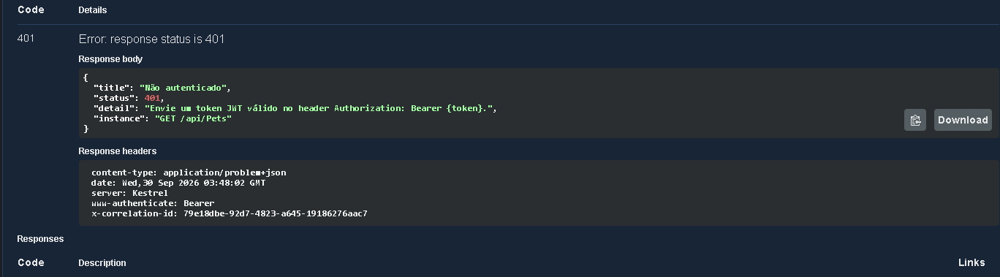

Logado como Usuario tentando excluir (403):

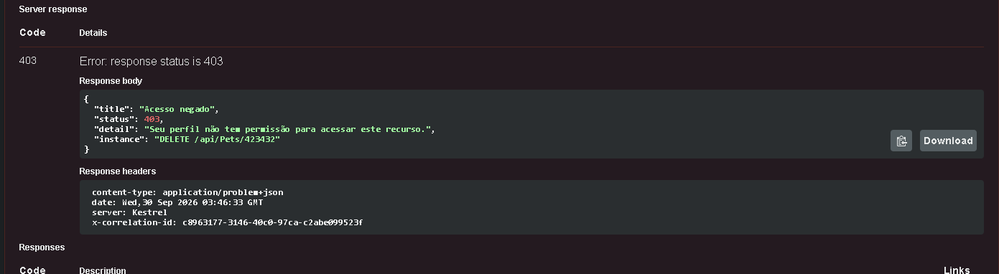

---

# Paginação, ordenação e filtros

Todas as listagens (`GET /api/Tutores`, `GET /api/Pets` etc.) aceitam os mesmos parâmetros. O `Skip` e o `Take` rodam **no banco**, então só a página pedida trafega pela rede.

| Parâmetro | Padrão | Regra |
|---|---|---|
| `pagina` | 1 | Valor menor que 1 vira 1 |
| `tamanhoPagina` | 10 | Máximo 50. Acima disso é limitado, e 0 ou negativo volta pro padrão |
| `ordenarPor` | id | Campo da ordenação (tabela abaixo) |
| `ascendente` | true | `false` inverte a ordem |

Filtros e campos de ordenação de cada entidade:

| Entidade | Filtros | `ordenarPor` aceita |
|---|---|---|
| Tutores | `nome`, `email`, `cpf` | `nome`, `email` |
| Pets | `nome`, `especie`, `raca`, `idTutor` | `nome`, `especie`, `peso`, `dataNascimento` |
| Clínicas | `nome`, `cnpj` | `nome` |
| Consultas | `idPet`, `idClinica`, `dataInicio`, `dataFim` | `data` |
| Vacinas | `nome`, `fabricante`, `idPet`, `proximaDoseAte` | `nome`, `dataAplicacao`, `proximaDose` |
| Medicamentos | `nome`, `idPet`, `emUso` | `nome`, `dataInicio` |
| Auditoria | `entidade`, `entidadeId`, `acao`, `dataInicio`, `dataFim` | sempre do mais recente pro mais antigo |

Os filtros de texto (nome, e-mail, espécie, raça, fabricante) buscam por pedaço da palavra, sem diferenciar maiúscula de minúscula. Os de id, CPF e CNPJ são exatos. O `emUso=true` traz os medicamentos sem data de fim ou com fim a partir de hoje. Dá pra combinar todos.

Exemplos:

```
GET /api/Pets?especie=Cachorro&ordenarPor=nome&pagina=1&tamanhoPagina=5
GET /api/Vacinas?proximaDoseAte=2026-12-31&ordenarPor=proximaDose
GET /api/Medicamentos?idPet=1&emUso=true
GET /api/Consultas?dataInicio=2026-01-01&dataFim=2026-06-30&ascendente=false
```

No Swagger os filtros aparecem como campos de preenchimento:

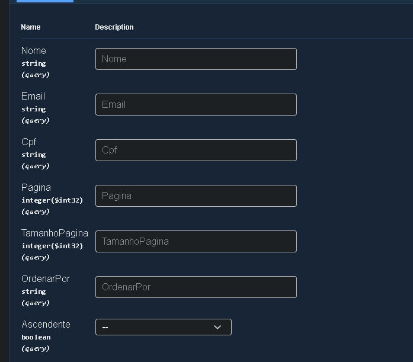

---

# HATEOAS

Toda resposta traz, junto com os dados, os **links pras próximas ações possíveis**. O app não precisa montar URL na mão — é só seguir os links.

Um recurso (`GET /api/Pets/1`):

```json
{
  "dados": {
    "idPet": 1,
    "nmPet": "Rex",
    "especie": "Cachorro",
    "raca": "Labrador",
    "peso": 28.5,
    "idTutor": 1
  },
  "links": [
    { "href": "/api/Pets/1", "rel": "self", "method": "GET" },
    { "href": "/api/Pets/1", "rel": "update", "method": "PUT" },
    { "href": "/api/Pets/1", "rel": "delete", "method": "DELETE" },
    { "href": "/api/Pets/1/historico", "rel": "historico", "method": "GET" },
    { "href": "/api/Tutores/1", "rel": "tutor", "method": "GET" },
    { "href": "/api/Consultas/pet/1", "rel": "consultas", "method": "GET" },
    { "href": "/api/Vacinas/pet/1", "rel": "vacinas", "method": "GET" },
    { "href": "/api/Medicamentos/pet/1", "rel": "medicamentos", "method": "GET" }
  ]
}
```

Uma lista paginada (`GET /api/Pets?pagina=2&tamanhoPagina=5`):

```json
{
  "itens": [ { "dados": { "...": "..." }, "links": [ "..." ] } ],
  "pagina": 2,
  "tamanhoPagina": 5,
  "totalItens": 23,
  "totalPaginas": 5,
  "temPaginaAnterior": true,
  "temProximaPagina": true,
  "links": [
    { "href": "/api/Pets?pagina=2&tamanhoPagina=5&ascendente=true", "rel": "self", "method": "GET" },
    { "href": "/api/Pets?pagina=1&tamanhoPagina=5&ascendente=true", "rel": "first", "method": "GET" },
    { "href": "/api/Pets?pagina=1&tamanhoPagina=5&ascendente=true", "rel": "previous", "method": "GET" },
    { "href": "/api/Pets?pagina=3&tamanhoPagina=5&ascendente=true", "rel": "next", "method": "GET" },
    { "href": "/api/Pets?pagina=5&tamanhoPagina=5&ascendente=true", "rel": "last", "method": "GET" },
    { "href": "/api/Pets", "rel": "create", "method": "POST" }
  ]
}
```

Os links de navegação **mantêm os filtros** que você usou: se filtrou por `especie=Cachorro`, o `next` continua filtrando. O `previous` só aparece se existe página anterior, e o `next` só se existe próxima.

O formato também aparece documentado no Swagger:

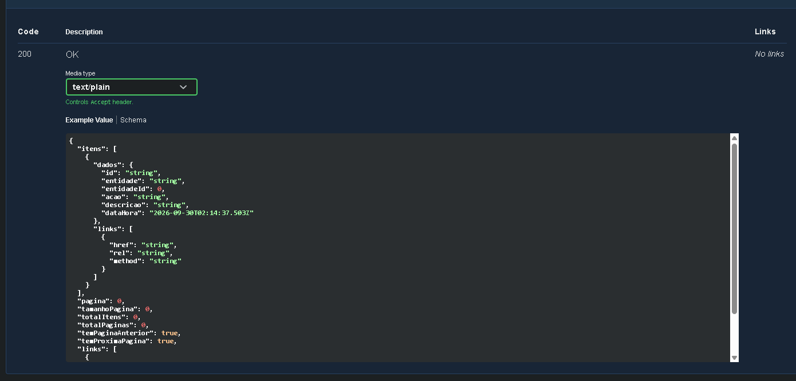

---

# Tratamento de erros

Nenhum controller tem `try/catch`. Toda exceção sobe até o `GlobalExceptionHandler`, que escolhe o status certo e responde no padrão **ProblemDetails** (`application/problem+json`):

| Exceção | Status |
|---|---|
| `RegraDeNegocioException` (ex: pet com tutor que não existe) | 400 Bad Request |
| `CredenciaisInvalidasException` (login com senha errada) | 401 Unauthorized |
| `DbUpdateException` (CPF repetido, excluir tutor que tem pet...) | 409 Conflict |
| Qualquer outra coisa | 500, com mensagem genérica |

Exemplo real, cadastrando um tutor com CPF que já existe:

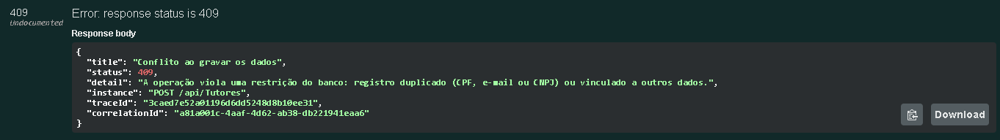

O `correlationId` também volta no header `X-Correlation-Id`. Com ele dá pra achar no log tudo o que aconteceu naquela requisição. Erro 500 vai pro log com a stack trace inteira, mas **nunca** aparece detalhe interno na resposta pro cliente.

---

# Auditoria com MongoDB

A API usa **dois bancos**, cada um no que faz melhor:

- **Oracle** guarda os dados de negócio (tutores, pets, consultas...), que têm relacionamento forte e regra de integridade.
- **MongoDB** guarda a **auditoria**: um log que só cresce, sem relacionamento, consultado por entidade e data. Caso clássico de banco de documentos.

Toda criação, atualização e exclusão das 6 entidades (e o cadastro de usuários) gera um documento na coleção `auditoria`:

```json
{
  "_id": { "$oid": "6abc75296803226ad69ddb17" },
  "Entidade": "Tutor",
  "EntidadeId": 63,
  "Acao": "CRIACAO",
  "Descricao": "Tutor Murillo Sprint Quatro cadastrado",
  "DataHora": { "$date": "2026-09-30T02:34:17Z" }
}
```

**A auditoria nunca derruba a operação principal.** Se o MongoDB cair, o cadastro no Oracle acontece normal e a falha fica registrada no log como `Warning`.

Dá pra consultar de dois jeitos:

- **Pela API:** `GET /api/Auditoria` (paginado, com filtros) e `GET /api/Auditoria/{entidade}/{id}` (histórico de um registro). Só Admin.
- **Pelo Mongo Express:** http://localhost:8081 → banco `petcare360` → coleção `auditoria`

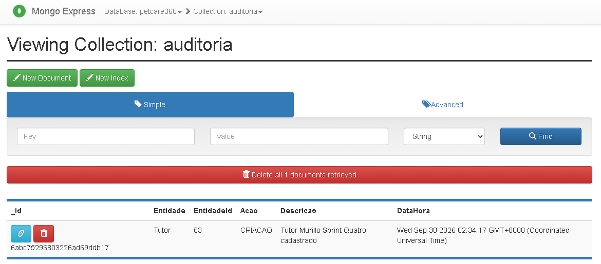

---

# Monitoramento e Observabilidade

## Health Checks

A API expõe quatro endpoints de saúde, seguindo a divisão de probes usada em Docker e Kubernetes:

| Endpoint | Tipo | O que responde | Depende de |
|---|---|---|---|
| `/health/live` | Liveness | A aplicação está viva? | nada |
| `/health/ready` | Readiness | A aplicação está pronta pra receber tráfego? | Oracle e MongoDB |
| `/health/startup` | Startup | A aplicação terminou de inicializar? | Oracle |
| `/health` | Geral | Roda os três de uma vez | Oracle e MongoDB |

**Por que separar.** O liveness responde 200 na hora, sem tocar em dependência nenhuma — se ele falhar, o processo travou e precisa ser reiniciado. O readiness verifica os bancos: se o Oracle ou o MongoDB cair, a aplicação continua viva mas não deveria receber requisições, e o orquestrador tira ela do balanceador sem matar o container. O startup checa se as migrations foram aplicadas, porque a API sobe normalmente com o banco vazio e só quebraria na primeira requisição.

**Checks implementados:**

- `self` (tag `live`) — retorna Healthy imediatamente
- `oracle-database` (tag `ready`) — usa `AddDbContextCheck` pra confirmar que o EF consegue conversar com o Oracle
- `mongodb` (tag `ready`) — check customizado que manda um `ping` pro MongoDB
- `migrations` (tag `startup`) — check customizado que verifica se há migrations pendentes

**Exemplo de resposta do `/health/ready`:**

```json
{
  "status": "Healthy",
  "totalDuration": "00:00:00.0612331",
  "entries": {
    "oracle-database": {
      "duration": "00:00:00.0412331",
      "status": "Healthy",
      "tags": ["ready"]
    },
    "mongodb": {
      "duration": "00:00:00.0034120",
      "status": "Healthy",
      "tags": ["ready"]
    }
  }
}
```

O `/health/live` devolve só o texto `Healthy`, sem JSON, porque probe de liveness tem que ser o mais leve possível.

**Como usar na prática.** Aponta o healthcheck do Docker ou o liveness probe do Kubernetes pro `/health/live`, e o readiness probe pro `/health/ready`. Um monitor externo pode bater no `/health` de tempos em tempos e alertar quando o status sair de `Healthy`.

## Logs

Os logs são estruturados com **Serilog** e saem em dois lugares:

- **Console** — durante o desenvolvimento
- **Arquivo** — em `logs/petcare360-AAAAMMDD.log`, com um arquivo por dia

Log estruturado significa que a mensagem não é texto solto: os valores viram campos pesquisáveis. Em vez de concatenar string, o código usa template com placeholder nomeado:

```csharp
_logger.LogInformation("Pet cadastrado com sucesso: {@Pet}", pet);
```

O `{@Pet}` serializa o objeto inteiro. Numa ferramenta de log dá pra filtrar por `Pet.Especie` sem precisar fazer regex em cima de texto.

**Correlação de requisições.** Todo request recebe um `CorrelationId`, gerado pelo `CorrelationIdMiddleware`. Ele aparece entre colchetes em toda linha de log daquela requisição e também volta no header `X-Correlation-Id` da resposta (inclusive nas respostas de erro). Se o cliente já mandar esse header, a API reaproveita o valor — assim o mesmo id atravessa app mobile, API e qualquer serviço no meio.

Exemplo de saída:

```
[22:32:20 INF] [8c6b7a2b-2485-4b35-b389-ece4eb268889] Tutor cadastrado com sucesso: {"IdTutor": 1, "NmTutor": "Diego Fontes", ...}
[22:32:20 INF] [8c6b7a2b-2485-4b35-b389-ece4eb268889] HTTP POST /api/Tutores responded 201 in 98.9586 ms
```

As duas linhas têm o mesmo id, então dá pra saber que pertencem à mesma chamada mesmo com várias requisições simultâneas.

**Níveis usados:** `Information` pra operações concluídas, `Warning` pra regra de negócio violada, requisição recusada (4xx) ou falha ao gravar auditoria, `Error` pra falhas inesperadas e `Fatal` se a aplicação não conseguir subir.

## Tracing e Métricas

Configurados com **OpenTelemetry**, exportando pro console.

**Tracing** responde "por onde a requisição passou". Cada chamada HTTP gera um trace com um `TraceId`, e dentro dele cada etapa vira um span com `SpanId` e `ParentSpanId`. As operações de negócio criam spans próprios via `ActivitySource`:

| Span | Onde acontece |
|---|---|
| `CadastrarPet` | PetService.CreateAsync |
| `ConsultarHistoricoPet` | PetService.GetHistoricoAsync |
| `CadastrarTutor` | TutorService.CreateAsync |
| `CadastrarClinica` | ClinicaService.CreateAsync |
| `RegistrarConsulta` | ConsultaService.CreateAsync |
| `RegistrarVacina` | VacinaService.CreateAsync |
| `PrescreverMedicamento` | MedicamentoService.CreateAsync |

Cada span carrega tags com o contexto do negócio (`pet.nome`, `pet.especie`, `consulta.clinica`). Assim, num POST de pet, dá pra ver quanto tempo foi HTTP, quanto foi regra de negócio e quanto foi banco. O mesmo `traceId` volta no corpo das respostas de erro.

**Métricas** respondem "como o sistema está no agregado". Vêm de duas fontes.

Automáticas, do ASP.NET Core:
- `http.server.request.duration` — histograma de tempo de resposta, quebrado por rota e status code. É daqui que sai o **tempo de resposta** e, olhando os status 4xx e 5xx, a **taxa de erros**.
- `http.server.active_requests` — requisições em andamento
- `aspnetcore.routing.match_attempts` — contagem por rota

Customizadas, do domínio:
- `pets_created_total` — com a espécie como tag, dá pra saber quantos cães e quantos gatos
- `tutores_created_total`
- `clinicas_created_total`
- `consultas_created_total`
- `vacinas_created_total`
- `medicamentos_created_total`

Os três tipos de métrica aparecem: **Counter** nos contadores de negócio, **Histogram** na duração das requisições e **Gauge** (`LongSumNonMonotonic`) nas requisições ativas.

Pra ver tudo funcionando, sobe a API e faz qualquer chamada — o console mostra o trace completo e, a cada intervalo, o dump das métricas.

---

# Testes

São **122 testes automatizados**, todos no padrão **AAA** (Arrange, Act, Assert), separados em dois projetos.

## Como rodar

Todos:

```powershell
dotnet test
```

Só os unitários:

```powershell
dotnet test PetCare360.UnitTests
```

Só os de integração:

```powershell
dotnet test PetCare360.IntegrationTests
```

Com mais detalhe na saída:

```powershell
dotnet test --logger "console;verbosity=detailed"
```

No Visual Studio: menu **Teste** → **Gerenciador de Testes**.

## Testes Unitários (87 testes)

Ficam em `PetCare360.UnitTests` e exercitam as camadas de **Domínio e Aplicação**. Nenhum encosta no banco: as dependências são substituídas por mocks do **Moq**.

```
PetCare360.UnitTests/
├── Fixtures/
│   └── TelemetryFixture.cs              ← IMeterFactory compartilhado via ICollectionFixture
├── Services/
│   ├── PetServiceTests.cs               ← 10 testes
│   ├── TutorServiceTests.cs             ← 6 testes
│   ├── ClinicaServiceTests.cs           ← 7 testes
│   ├── ConsultaServiceTests.cs          ← 8 testes
│   ├── VacinaServiceTests.cs            ← 6 testes
│   ├── MedicamentoServiceTests.cs       ← 6 testes
│   ├── AuthServiceTests.cs              ← 5 testes
│   └── AuditoriaServiceTests.cs         ← 4 testes
├── Domain/
│   ├── PagedResultTests.cs              ← 6 testes
│   └── QueryParametersTests.cs          ← 6 testes
├── Security/
│   ├── Pbkdf2SenhaHasherTests.cs        ← 5 testes
│   └── JwtTokenServiceTests.cs          ← 2 testes
├── Hateoas/
│   └── HateoasBuilderTests.cs           ← 5 testes
├── Handlers/
│   └── GlobalExceptionHandlerTests.cs   ← 5 testes
└── Controllers/
    └── PetsControllerTests.cs           ← 6 testes
```

**Nomenclatura:** todos seguem `MetodoTestado_Cenario_ResultadoEsperado`. Exemplos:

- `CreateAsync_TutorNaoExiste_LancaRegraDeNegocioException`
- `UpdateAsync_ClinicaNaoExiste_RetornaFalseSemAuditar`
- `RegistrarAsync_MongoIndisponivel_NaoPropagaExcecao`
- `TryHandleAsync_DbUpdateException_RetornaConflict`

**Fixture:** os services recebem um `IMeterFactory` no construtor pra registrar métricas. Criar um provider novo a cada teste seria desperdício, então a `TelemetryFixture` cria um só e o xUnit compartilha entre as classes através da `[CollectionDefinition("ServicesCollection")]`.

**Verificação de chamadas:** além dos asserts no retorno, os testes usam `Verify` pra checar se o service chamou (ou deixou de chamar) o repositório e a auditoria. É o que prova, por exemplo, que quando o tutor não existe o pet realmente **não** foi gravado:

```csharp
_mockPetRepository.Verify(r => r.AddAsync(It.IsAny<Pet>()), Times.Never);
```

## Testes de Integração (35 testes)

Ficam em `PetCare360.IntegrationTests` e sobem a **API inteira em memória** com `WebApplicationFactory`, disparando requisições HTTP reais.

```
PetCare360.IntegrationTests/
├── FactoryFixture/
│   └── ApiFactoryFixture.cs                    ← sobe a API, troca os bancos e gera o token
├── Fakes/
│   └── FakeAuditoriaRepository.cs              ← auditoria em memória no lugar do MongoDB
└── Integration/
    ├── TutoresControllerIntegrationTests.cs    ← 5 testes
    ├── PetsControllerIntegrationTests.cs       ← 6 testes
    ├── PaginacaoIntegrationTests.cs            ← 5 testes
    ├── HateoasIntegrationTests.cs              ← 3 testes
    ├── AuditoriaIntegrationTests.cs            ← 2 testes
    ├── AuthIntegrationTests.cs                 ← 6 testes
    ├── AutorizacaoIntegrationTests.cs          ← 6 testes
    └── HealthCheckIntegrationTests.cs          ← 2 testes
```

**Substituição de dependências:** a `ApiFactoryFixture` troca tudo o que é externo:

- o Oracle vira um banco **InMemory**
- o MongoDB vira o `FakeAuditoriaRepository`, e o health check dele é removido
- todo cliente HTTP já sai com um **token JWT de Admin**, gerado pelo próprio `ITokenService` da aplicação. Os testes de segurança usam clientes sem token ou com perfil Usuario.

Assim os testes rodam em qualquer máquina, sem depender do banco da FIAP nem do Docker estar no ar.

**O que é validado:** fluxo HTTP completo, respostas de sucesso (200, 201, 204), erros (400, 401, 403, 404), paginação e filtros pela URL, links HATEOAS, auditoria sendo gravada, login e permissões por perfil, e os endpoints de health check.

O teste `CicloCompleto_CriarAtualizarEDeletar_FunicionaDePontaAPonta` faz o caminho inteiro numa tacada: cria um pet, atualiza, consulta pra confirmar a alteração, deleta e confirma que sumiu. E o `ExcluirTutor_PerfilUsuario_RetornaForbidden` prova que um usuário comum não consegue excluir, e que o tutor continua lá depois da tentativa.

> **Observação:** o `/health/startup` não é coberto pelos testes de integração porque ele verifica migrations pendentes, e o provedor InMemory não trabalha com migrations. Esse endpoint se valida rodando contra o Oracle de verdade.

## Cobertura de código

A cobertura foi medida nas camadas de **Domínio e Aplicação**:

| Camada | Cobertura de linhas |
|---|---|
| PetCare360.Domain | **98,3%** |
| PetCare360.Application | **90,5%** |
| **Total** | **92,1%** (549 de 596 linhas) |
| Branches | 77,9% |

O relatório completo, classe por classe, está em [`docs/cobertura/index.html`](docs/cobertura/index.html).

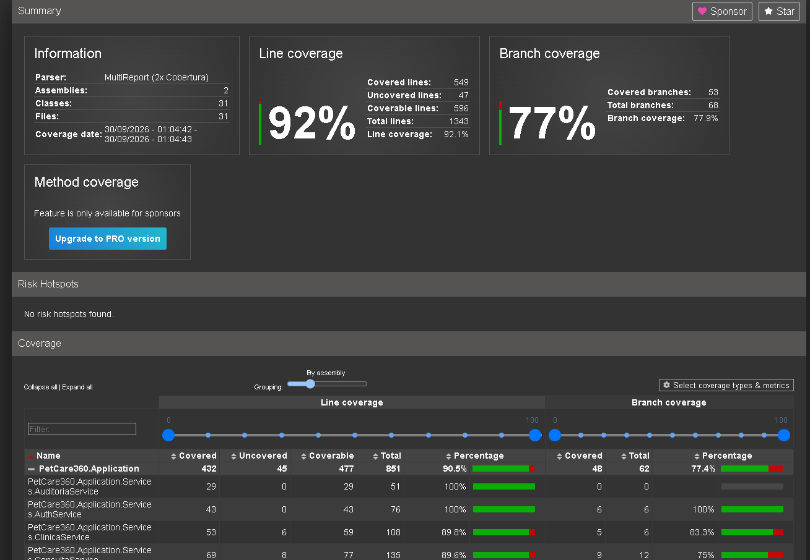

Pra gerar o relatório de novo:

```powershell
dotnet tool install -g dotnet-reportgenerator-globaltool
dotnet test --collect:"XPlat Code Coverage" --results-directory ./TestResults
reportgenerator -reports:"./TestResults/**/coverage.cobertura.xml" -targetdir:"./docs/cobertura" -reporttypes:"Html;TextSummary" -assemblyfilters:"+PetCare360.Domain;+PetCare360.Application"
```

---

# Como testar no Swagger (roteiro pra demonstrar tudo funcionando)

Segue essa ordem pra ver a API funcionando ponta-a-ponta. Os IDs retornados nos POSTs (1, 2, 3...) você usa nos passos seguintes.

### 1. Fazer login — `POST /api/Auth/login`

```json
{
  "email": "admin@petcare360.com",
  "senha": "Admin@123"
}
```

Copia o `token`, clica em **Authorize** e cola. Sem isso, todos os passos abaixo voltam 401.

### 2. Criar um tutor — `POST /api/Tutores`

```json
{
  "nmTutor": "Murillo Silva",
  "cpf": "123.456.789-00",
  "email": "murillo@email.com",
  "telefone": "(11) 99999-1111",
  "endereco": "Rua dos Pets, 360"
}
```

### 3. Criar uma clínica — `POST /api/Clinicas`

```json
{
  "nmClinica": "Clínica Pet Center",
  "cnpj": "12.345.678/0001-99",
  "endereco": "Av. Paulista, 1500",
  "telefone": "(11) 3000-0001",
  "email": "contato@petcenter.com"
}
```

### 4. Criar um pet (usando o `idTutor` do passo 2) — `POST /api/Pets`

```json
{
  "nmPet": "Rex",
  "especie": "Cachorro",
  "raca": "Labrador",
  "dtNascimento": "2020-05-10T00:00:00",
  "peso": 28.5,
  "idTutor": 1
}
```

### 5. Criar uma consulta — `POST /api/Consultas`

```json
{
  "dtConsulta": "2026-05-20T14:00:00",
  "descricao": "Consulta de rotina",
  "diagnostico": "Pet saudável",
  "idPet": 1,
  "idClinica": 1
}
```

### 6. Cadastrar uma vacina — `POST /api/Vacinas`

```json
{
  "nmVacina": "V10",
  "fabricante": "Zoetis",
  "dtAplicacao": "2026-05-20T00:00:00",
  "dtProximaDose": "2027-05-20T00:00:00",
  "idPet": 1,
  "idConsulta": 1
}
```

### 7. Cadastrar um medicamento — `POST /api/Medicamentos`

```json
{
  "nmMedicamento": "Vermífugo",
  "dosagem": "1 comprimido",
  "frequencia": "A cada 6 meses",
  "dtInicio": "2026-05-20T00:00:00",
  "dtFim": "2026-05-20T00:00:00",
  "idPet": 1,
  "idConsulta": 1
}
```

### 8. Ver o histórico completo do pet — `GET /api/Pets/1/historico`

Esse endpoint traz o pet com **todas as consultas, vacinas e medicamentos** juntos, mais os links HATEOAS. É o coração da API.

### 9. Testar paginação e filtros — `GET /api/Pets`

Preenche `Especie = Cachorro`, `OrdenarPor = nome` e `TamanhoPagina = 2`. Na resposta, repara nos links `next` e `last` e no `totalPaginas`.

### 10. Ver a auditoria — `GET /api/Auditoria`

Aparecem os registros de `CRIACAO` de tudo o que você cadastrou nos passos anteriores. Dá pra conferir também no Mongo Express (http://localhost:8081).

### 11. Testar erros propositais (mostra que as validações funcionam)

- `GET /api/Tutores/999` → retorna **404 NotFound** ("Tutor não encontrado")
- `POST /api/Pets` com `idTutor: 999` (tutor inexistente) → retorna **400 BadRequest** com a mensagem "O tutor informado não existe."
- `POST /api/Tutores` repetindo o CPF do passo 2 → retorna **409 Conflict** em ProblemDetails
- `DELETE /api/Tutores/1` (tutor com pets vinculados) → retorna **409 Conflict** porque a regra de FK proíbe deletar tutores que têm pets cadastrados

### 12. Testar as permissões

1. Clica em **Authorize → Logout** e executa `GET /api/Pets` → **401**
2. Cria um usuário comum em `POST /api/Auth/registrar`:
   ```json
   {
     "nome": "Usuario Comum",
     "email": "comum@petcare360.com",
     "senha": "comum123"
   }
   ```
3. Faz login com ele e autoriza com o token novo
4. `GET /api/Pets` funciona ✅, mas `DELETE /api/Pets/1` e `GET /api/Auditoria` voltam **403** ❌

### 13. Conferir a observabilidade

Depois de fazer essas chamadas, olha o console da aplicação: vão estar lá os logs do Serilog com o correlation id, os spans do OpenTelemetry (`CadastrarPet`, `RegistrarVacina`) e o dump das métricas com os contadores. E acessa `/health/ready` pra ver o Oracle e o MongoDB respondendo.

---

# Prints do Swagger

Pra ter uma ideia do que esperar antes de rodar, segue como a interface fica:

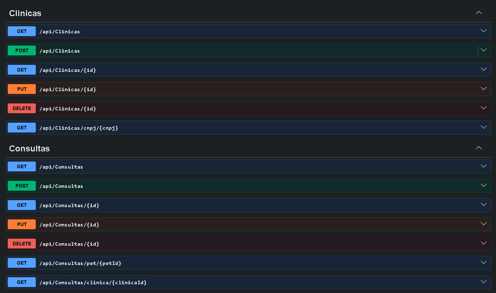

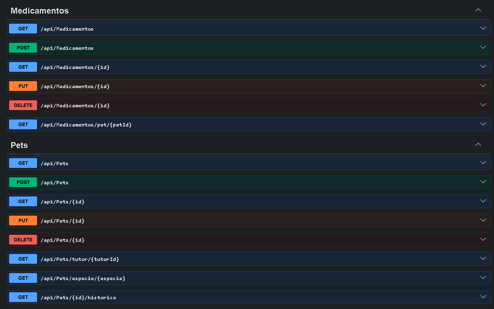

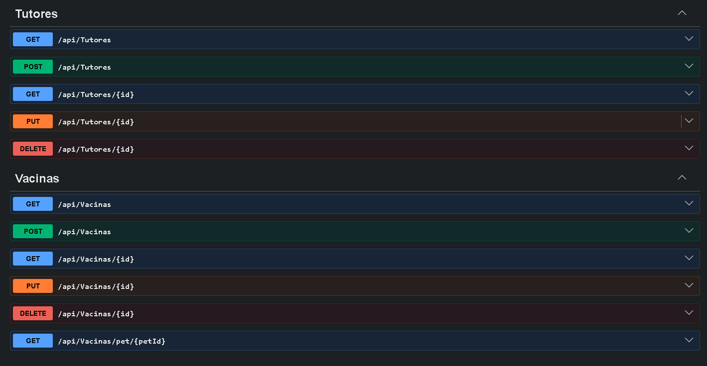

A especificação OpenAPI completa também foi **exportada** pra [`docs/swagger.json`](docs/swagger.json). Dá pra importar no Postman ou no Insomnia sem precisar rodar a API. Pra exportar de novo, com a API rodando, é só abrir `/swagger/v1/swagger.json` e salvar.

---

# Endpoints disponíveis

A documentação interativa completa está no Swagger depois de rodar a aplicação. Resumo das rotas:

> 🔒 = precisa estar logado · 👑 = só Admin

### Auth — `/api/Auth`
- `POST /api/Auth/registrar` — cria um usuário com perfil Usuario (público)
- `POST /api/Auth/login` — faz login e devolve o token (público)
- `GET /api/Auth/me` — dados do usuário logado 🔒

### Tutores — `/api/Tutores`
- `GET /api/Tutores` — lista paginada, com filtros e ordenação 🔒
- `GET /api/Tutores/{id}` — busca por ID 🔒
- `POST /api/Tutores` — cria 🔒
- `PUT /api/Tutores/{id}` — atualiza 🔒
- `DELETE /api/Tutores/{id}` — remove 👑

### Pets — `/api/Pets`
- `GET /api/Pets` — lista paginada, com filtros e ordenação 🔒
- `GET /api/Pets/{id}` — busca por ID 🔒
- `GET /api/Pets/tutor/{tutorId}` — lista pets de um tutor 🔒
- `GET /api/Pets/especie/{especie}` — filtra por espécie 🔒
- `GET /api/Pets/{id}/historico` — pet + consultas + vacinas + medicamentos ⭐ 🔒
- `POST /api/Pets` — cria 🔒
- `PUT /api/Pets/{id}` — atualiza 🔒
- `DELETE /api/Pets/{id}` — remove 👑

### Clínicas — `/api/Clinicas`
- `GET /api/Clinicas` — lista paginada, com filtros e ordenação 🔒
- `GET /api/Clinicas/{id}` — busca por ID 🔒
- `GET /api/Clinicas/cnpj/{cnpj}` — busca por CNPJ 🔒
- `POST /api/Clinicas` — cria 🔒
- `PUT /api/Clinicas/{id}` — atualiza 🔒
- `DELETE /api/Clinicas/{id}` — remove 👑

### Consultas — `/api/Consultas`
- `GET /api/Consultas` — lista paginada, com filtros e ordenação 🔒
- `GET /api/Consultas/{id}` — busca por ID 🔒
- `GET /api/Consultas/pet/{petId}` — consultas de um pet 🔒
- `GET /api/Consultas/clinica/{clinicaId}` — consultas de uma clínica 🔒
- `POST /api/Consultas` — cria 🔒
- `PUT /api/Consultas/{id}` — atualiza 🔒
- `DELETE /api/Consultas/{id}` — remove 👑

### Vacinas — `/api/Vacinas`
- `GET /api/Vacinas` — lista paginada, com filtros e ordenação 🔒
- `GET /api/Vacinas/{id}` — busca por ID 🔒
- `GET /api/Vacinas/pet/{petId}` — vacinas de um pet 🔒
- `POST /api/Vacinas` — cria 🔒
- `PUT /api/Vacinas/{id}` — atualiza 🔒
- `DELETE /api/Vacinas/{id}` — remove 👑

### Medicamentos — `/api/Medicamentos`
- `GET /api/Medicamentos` — lista paginada, com filtros e ordenação 🔒
- `GET /api/Medicamentos/{id}` — busca por ID 🔒
- `GET /api/Medicamentos/pet/{petId}` — medicamentos de um pet 🔒
- `POST /api/Medicamentos` — cria 🔒
- `PUT /api/Medicamentos/{id}` — atualiza 🔒
- `DELETE /api/Medicamentos/{id}` — remove 👑

### Auditoria — `/api/Auditoria`
- `GET /api/Auditoria` — registros de auditoria paginados, do mais recente pro mais antigo 👑
- `GET /api/Auditoria/{entidade}/{entidadeId}` — histórico de um registro (ex: `/api/Auditoria/Pet/1`) 👑

### Health Checks
- `GET /health/live` — liveness
- `GET /health/ready` — readiness (Oracle + MongoDB)
- `GET /health/startup` — startup
- `GET /health` — todos de uma vez

**Total: 43 endpoints** (38 das 6 entidades + 3 de autenticação + 2 de auditoria), **mais 4 endpoints de monitoramento**.

### Códigos de resposta

| Status | Quando acontece |
|---|---|
| 200 OK | Consulta com sucesso |
| 201 Created | Cadastro com sucesso (o header `Location` aponta pro recurso criado) |
| 204 No Content | Atualização ou exclusão com sucesso |
| 400 Bad Request | Dados inválidos ou regra de negócio violada |
| 401 Unauthorized | Sem token, token vencido ou senha errada no login |
| 403 Forbidden | Logado, mas sem o perfil necessário |
| 404 Not Found | Registro não encontrado |
| 409 Conflict | CPF, e-mail ou CNPJ repetido, ou exclusão bloqueada por vínculo |
| 500 Internal Server Error | Erro inesperado (sem expor detalhe interno) |

---

# Como os dados se ligam

```
TB_TUTOR (1) ─────┐
                  │ N
                  ▼
TB_PET (1) ──┬──→ TB_CONSULTA (N) ←── TB_CLINICA (1)
             │
             ├──→ TB_VACINA (N)
             │
             └──→ TB_MEDICAMENTO (N)

TB_USUARIO_PETCARE (independente — login e perfis)

MongoDB › petcare360 › auditoria (um documento por operação)
```

Regras de integridade que ficaram explícitas no banco:

- Não dá pra apagar um tutor que ainda tem pets cadastrados (apaga os pets primeiro)
- Não dá pra apagar uma clínica que tem histórico de consultas (preserva histórico)
- CPF e email do tutor são únicos no sistema
- CNPJ da clínica é único
- E-mail do usuário é único

E as regras que ficam na camada de aplicação:

- Pet só pode ser cadastrado com um tutor que existe
- Consulta exige pet e clínica existentes
- Vacina e medicamento exigem um pet existente
- Não dá pra cadastrar dois usuários com o mesmo e-mail

---

# Estrutura do código

O projeto está dividido em 4 camadas, mais 2 projetos de teste (a explicação de cada uma está na seção [Arquitetura](#arquitetura)).

```
Challenge.NET/
├── PetCare360.Domain/                  ← entidades e contratos. Não depende de ninguém.
│   ├── Dtos/                           ← LoginRequest, RegistroUsuarioRequest, TokenResponse, UsuarioResponse
│   ├── Entities/                       ← Tutor, Pet, Clinica, Consulta, Vacina, Medicamento, Usuario, RegistroAuditoria
│   ├── Exceptions/                     ← RegraDeNegocioException, CredenciaisInvalidasException
│   ├── Interfaces/                     ← contratos de repositório, service, token e hash de senha
│   └── Pagination/                     ← QueryParameters, PagedResult e os filtros de cada entidade
├── PetCare360.Application/             ← regras de negócio. Depende só do Domain.
│   ├── Services/                       ← os 6 services + AuditoriaService + AuthService
│   └── Diagnostics/
│       └── TelemetryConstants.cs
├── PetCare360.Infrastructure/          ← EF Core, Oracle, MongoDB, JWT, health checks
│   ├── Data/
│   │   ├── AppDbContext.cs             ← configuração do EF Core (Fluent API + relacionamentos)
│   │   └── AdminSeeder.cs              ← cria o admin padrão na primeira execução
│   ├── Extensions/
│   │   └── QueryableExtensions.cs      ← Ordenar() e PaginarAsync()
│   ├── HealthChecks/
│   │   ├── MigrationsHealthCheck.cs
│   │   └── MongoDbHealthCheck.cs
│   ├── Migrations/                     ← InitialCreate, AjusteModelo e AdicionaUsuarios
│   ├── NoSql/                          ← configuração e mapeamento do MongoDB
│   ├── Repositories/                   ← repositórios EF Core (Oracle) + AuditoriaRepository (MongoDB)
│   ├── Security/                       ← JwtSettings, JwtTokenService, Pbkdf2SenhaHasher
│   └── DependencyInjection.cs          ← registra tudo no container
├── PetCare360.API/                     ← controllers e configuração da aplicação
│   ├── Controllers/                    ← 6 de entidade + AuthController + AuditoriaController
│   ├── Extensions/                     ← configuração do JWT e do Swagger
│   ├── Handlers/
│   │   └── GlobalExceptionHandler.cs
│   ├── Hateoas/                        ← Link, Recurso, RecursoPaginado, HateoasBuilder
│   ├── Middleware/
│   │   └── CorrelationIdMiddleware.cs
│   ├── Properties/
│   │   └── launchSettings.json         ← perfis de execução (http/https)
│   ├── Program.cs                      ← entrada, Serilog, autenticação, health checks, Swagger
│   ├── appsettings.json                ← config (a senha do Oracle fica no User Secrets)
│   └── PetCare360.API.csproj
├── PetCare360.UnitTests/               ← testes unitários com Moq
├── PetCare360.IntegrationTests/        ← testes de integração com WebApplicationFactory
├── docs/
│   ├── cobertura/                      ← relatório HTML de cobertura
│   ├── screenshots/                    ← prints usados neste README
│   └── swagger.json                    ← especificação OpenAPI exportada
├── docker-compose.yml                  ← MongoDB + Mongo Express
├── .gitignore
├── PetCare360.API.slnx                 ← solução .NET
└── README.md                           ← este arquivo
```

---

# Resolução de problemas comuns

**"dotnet-ef" não é reconhecido como comando**
> Você não instalou o tool. Volte ao Passo 3.

**Erro `ORA-12541: TNS:no listener` ou `ORA-12170: TNS:Connect timeout`**
> A connection string tá errada ou o servidor Oracle não tá acessível. Confere o `Data Source` no User Secrets.

**Erro `ORA-01017: invalid username/password`**
> Usuário ou senha errados no User Secrets, ou você esqueceu de configurar. Confere o Passo 4.

**Erro `ORA-00942: a tabela ou view não existe`**
> Você conectou no banco mas as tabelas não existem nesse schema. Roda o Passo 5.

**Erro `ORA-00955: name is already used by an existing object`**
> O banco já tem alguma tabela com nome conflitante (de outro projeto, por exemplo). Apaga ela no banco antes de rodar as migrations.

**`/health/ready` mostra o `mongodb` como Unhealthy**
> O container do MongoDB não está rodando. Abre o Docker Desktop, roda `docker compose up -d` e confere com `docker ps`.

**Toda requisição volta 401**
> Faltou fazer login e clicar em **Authorize**. O token vale 120 minutos — depois disso é só logar de novo.

**DELETE ou Auditoria voltam 403**
> Você está logado com um usuário comum. Essas ações são só do Admin.

**O Visual Studio para numa `DbUpdateException` quando roda com F5**
> É o debugger pausando na exceção antes do handler global tratar. Clica em **Continuar** (a API responde 409) ou roda sem debug com **Ctrl+F5**.

**Erro `MSB3027` ou "the process cannot access the file" no build**
> A API ainda está rodando e travou os arquivos. Para ela (Shift+F5 no Visual Studio) antes de compilar.

**Swagger abre mas dá 500 ao testar endpoints**
> Você esqueceu de rodar `dotnet ef database update` no Passo 5. Sem isso as tabelas não existem.

**A página `/swagger` dá 404**
> O perfil de execução tá em produção. Garanta que `ASPNETCORE_ENVIRONMENT` esteja como `Development` (o `launchSettings.json` do projeto já faz isso por padrão).

---

# Sobre o projeto

Esse é um trabalho de faculdade do meu 2º ano de ADS. O foco era demonstrar domínio dos conceitos da matéria de **Advanced Business Development with .NET**: Web API, Clean Architecture, EF Core com Oracle, MongoDB, REST com HATEOAS, JWT, OpenAPI, observabilidade e testes automatizados.

Uma coisa que ficou anotada desde a sprint passada: como o projeto usa nullable reference types, campos `string` sem `?` viram obrigatórios na validação do ASP.NET mesmo sem `[Required]`. Isso afeta `Raca` no Pet e alguns outros campos que eu tinha pensado como opcionais. Corrigir exige migration nova, então deixei documentado.

Se você é o professor avaliando isso: bem-vindo, espero ter feito direito 

---

Petcare360 · 2TDSPW · FIAP · Setembro de 2026
